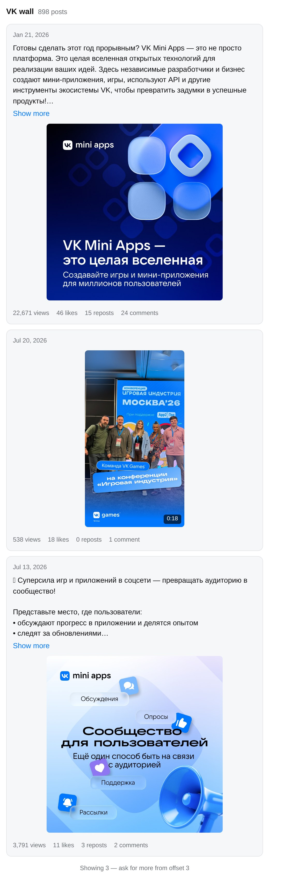

# VK MCP Server — ВКонтакте для Claude и других AI-ассистентов

<p align="center">
  <a href="https://www.npmjs.com/package/vk-mcp-server"></a>
  <a href="https://github.com/bulatko/vk-mcp-server/actions"></a>
  <a href="https://github.com/bulatko/vk-mcp-server/blob/master/LICENSE"></a>
</p>

[English](README.md) · **Русский**

MCP-сервер, через который Claude, Cursor, VS Code и другие клиенты
[Model Context Protocol](https://modelcontextprotocol.io) работают с ВКонтакте:
читают стены и сообщества, публикуют посты и истории, разбирают сообщения
сообщества и отвечают на них. Открытый код, MIT, без своих серверов — всё
работает у вас на компьютере с вашим токеном.

<p align="center">
  
</p>

## Что можно делать

- **Разбирать входящие сообщества.** «Покажи непрочитанное и предложи ответы» —
  ассистент перечислит диалоги, перескажет каждый, набросает ответы, а отправит
  только те, что вы одобрили
- **Публиковать от имени сообщества** — посты, комментарии, истории (фото и видео)
- **Читать** стены, профили, информацию о сообществах и их участниках — с
  постраничной навигацией, которая сама объясняет, где продолжить
- **Видеть, а не читать JSON**: в клиентах с поддержкой MCP Apps (Claude, Claude
  Desktop, VS Code Copilot, Goose) стены, сообщества и профили показываются
  карточками
- **Готовые сценарии** (промпты): дайджест сообщества, отчёт по вовлечённости,
  портрет аудитории, поиск сообществ, разбор входящих

25 инструментов; запись помечена как запись, чтобы клиент спрашивал перед ней.

## Быстрый старт

**Claude Desktop — в один клик.** Скачайте `.mcpb` со
[страницы релизов](https://github.com/bulatko/vk-mcp-server/releases/latest) и
откройте его: Claude Desktop установит сервер и попросит токены в форме. Node.js
и конфиги не нужны.

**Claude Code, Cursor и другие** — добавьте в конфиг MCP (`.mcp.json` для Claude
Code, `claude_desktop_config.json` для Claude Desktop):

```json
{
  "mcpServers": {
    "vk": {
      "command": "npx",
      "args": ["-y", "vk-mcp-server"],
      "env": {
        "VK_ACCESS_TOKEN": "vk1.a...токен сообщества",
        "VK_SERVICE_KEY": "...сервисный ключ"
      }
    }
  }
}
```

Нужен Node.js 20 или новее.

## Какие токены нужны

ВКонтакте сильно ограничил, что может каждый вид токена. Ниже — не документация
VK, а то, что мы проверили на живом API в октябре 2026:

| Токен | Где взять | Что умеет |
|---|---|---|
| **Токен сообщества** | Сообщество → Управление → Работа с API → Ключи доступа → Создать ключ | От имени сообщества: посты, комментарии, истории, сообщения сообщества. **Не** читает стены, **не** редактирует и не удаляет посты, **не** загружает фото на стену |
| **Сервисный ключ** | Настройки вашего приложения VK | Читает публичные профили, стены, сообщества. Ничего не пишет |
| **VK ID** (`vk2.a…`) | `npx vk-mcp-server --login <APP_ID>` | Те же публичные чтения, что и сервисный ключ |

**Лучший вариант — оба сразу.** Токен сообщества в `VK_ACCESS_TOKEN`, сервисный
ключ в `VK_SERVICE_KEY`. Сервер сначала пробует токен сообщества, а чтения,
в которых VK ему отказывает (стена, например), сам повторяет сервисным ключом.
Запись на ключ не уходит никогда.

Токен сообщества создаётся за три клика и не протухает. Отметьте права
`wall`, `photos`, `stories`, `messages` и `manage`. Раздел «Работа с API» есть
только в полной веб-версии — на телефоне включите «версию для компьютера».

**Чего сейчас не может ни один токен, который VK выдаёт новым приложениям:**
редактировать и удалять посты, загружать фото на стену, читать статистику,
лайки, фотоальбомы, поиск и ленту новостей. VK оставил это полным
пользовательским токенам, а их новым приложениям больше не выдаёт. Инструменты
для этого в сервере есть — они работают, если такой токен у вас остался.

Проверить, что умеет ваш токен:

```bash
VK_ACCESS_TOKEN=... VK_SERVICE_KEY=... npx vk-mcp-server --check
```

Подробно, по шагам и с разбором ошибок — в [docs/SETUP.md](docs/SETUP.md)
(на английском).

## Сообщения сообщества

| Инструмент | Что делает |
|---|---|
| `vk_messages_get_conversations` | Диалоги, новые сверху; `filter: "unread"` — то, что ждёт ответа |
| `vk_messages_get_history` | Переписка в одном диалоге |
| `vk_messages_send` | ✏️ Ответ от имени сообщества — уходит живому человеку, клиент спросит подтверждение |
| `vk_messages_mark_as_read` | ✏️ Отметить диалог прочитанным |

Нужны право `messages` у токена и включённые сообщения в настройках сообщества.
VK разрешает сообществу писать только тем, кто написал первым или разрешил
сообщения от сообщества. Повтор запроса после лимита VK не доставит сообщение
дважды.

Проще всего начать с промпта `community_inbox`: он пройдёт по непрочитанным,
перескажет каждый диалог и подготовит черновики ответов.

## Все инструменты

Полный список с описаниями — в [английском README](README.md#available-tools):
пользователи, стена, сообщества, фото, истории, сообщения, лайки, статистика.

## Частые ошибки

| Что видите | Что это значит |
|---|---|
| `error 27: Group authorization failed` | Токену сообщества VK этот метод не даёт (чтение стены, например). Задайте `VK_SERVICE_KEY` — чтения пойдут через ключ |
| `error 1051` или `error 28` | Метод закрыт для этого вида токена. Чтобы писать — нужен токен сообщества |
| `error 901` | Человек не писал сообществу и не разрешал сообщения от него |
| `error 5` с `subcode 1130` | Токен привязан к IP, с которого его получили, а сервер работает с другого. Используйте токен сообщества — он не привязан |
| `No VK token configured` | Клиент не передал токен серверу — проверьте блок `env` в конфиге клиента |

## Ссылки

- npm: [vk-mcp-server](https://www.npmjs.com/package/vk-mcp-server)
- Официальный реестр MCP: `io.github.bulatko/vk`
- Что нового: [CHANGELOG.md](CHANGELOG.md)
- Нашли ошибку или нужен метод — [issues](https://github.com/bulatko/vk-mcp-server/issues), PR приветствуются

Лицензия MIT.
